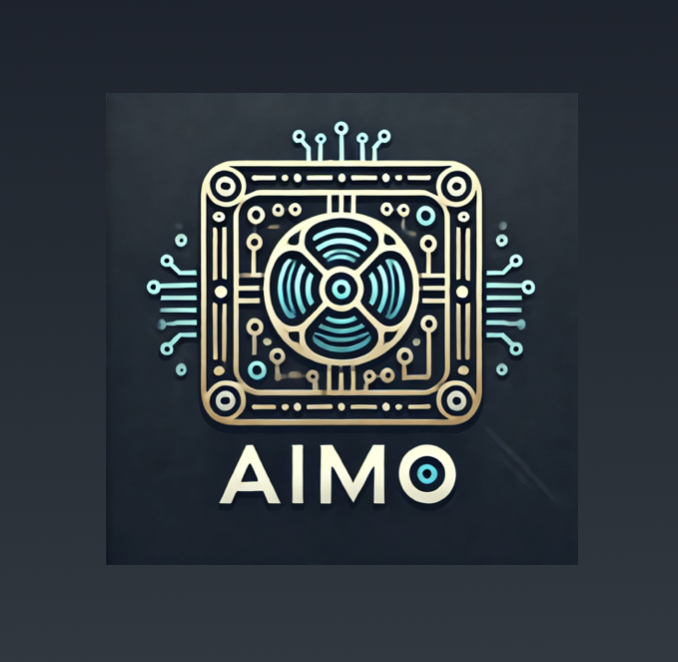

# AiMo - A Movie Recommender



[Try AiMo Here](https://tidbcloud.com/)

[View the demo here](https://youtu.be/W5SzUXqttPI)

AiMo is an AI-powered movie recommender system that generates personalized movie suggestions based on your storyline input and movie preferences. Simply input a storyline or prompt that you find interesting, and AiMo will recommend a curated list of movies that match your query. By indicating which recommendations you like, AiMo learns and improves future suggestions tailored specifically to your tastes.

This project leverages TiDB for hosting a Vector Database and SQL Databases, ensuring quick and accurate movie recommendations based on past user interactions. The movie data is retrieved using the Cinemagoer Python package.

## Features

- **Personalized Recommendations:** Input a storyline or prompt and receive movie suggestions tailored to your preferences.
- **Learning System:** AiMo improves its recommendations over time based on your feedback.
- **Scalable Architecture:** Utilizes TiDB for efficient data management and fast query responses.
- **Extensive Movie Database:** Access a wide range of movies with data sourced from the Cinemagoer Python package.

## Prerequisites

To run AiMo locally, you'll need the following:

- A [TiDB Cloud](https://tidbcloud.com/) account.
- Python 3.10+ installed.
- A GitHub account to clone the repository.

## Getting Started

### 1. Clone the Repository

```bash
git clone "https://github.com/Vineet-Vinod/TiDB-Hackathon.git"
```

### 2. Set Up the Python Environment

Create a Python virtual environment and activate it:

```bash
python3 -m venv venv
source venv/bin/activate
# On Windows use venv\Scripts\activate`
```

Install the required Python libraries:

```bash
pip install -r requirements.txt
```

### 3. Configure TiDB Connection

1. Create a `.env` file in the `src/tidb` and `src/website` directories containing your TiDB connection parameters. An example `.env` file looks like:

   ```plaintext
   TIDB_HOST=<your-tidb-host>
   TIDB_USER=<your-tidb-user>
   TIDB_PASSWORD=<your-tidb-password>
   TIDB_DB_NAME='app_main'
   CONNECTION_STR=<your-connection-string>
   TIDB_PORT='4000'
   CA_PATH='cert.pem'
   EMBED_MODEL_DIMS='768'
   ```

   [Follow this TiDB guide to get started with TiDB in Python](https://docs.pingcap.com/tidbcloud/vector-search-get-started-using-python)

2. Download the `cert.pem` file containing your CA certificate from the TiDB Cloud Database connection page, and place it in the `src/tidb` and `src/website` directories.

### 4. Initialize the Database

Before running the project, ensure you have a database named `app_main` in your TiDB cluster. Then, run the following scripts:

1. In the `src/tidb` folder, execute:

   ```bash
   python create_tables.py
   python add_mov.py
   ```

   > **Note:** Comment out the lines containing division by zero in the `add_mov.py` script to avoid errors.

### 5. Run the Web Application

To start the Flask application:

1. Navigate to the `src` directory.
2. Run the following command:

   ```bash
   flask run
   ```

The application will be available locally at `http://127.0.0.1:5000/`.

## License

This project is licensed under the GNU General Public License v3.0. See the [LICENSE](LICENSE) file for details.

## Acknowledgments

- [TiDB Cloud](https://tidbcloud.com/) for the scalable database solution.
- [Cinemagoer](https://github.com/cinemagoer/cinemagoer) for providing access to extensive movie data.

---

Happy movie watching with AiMo! 🎥🍿
